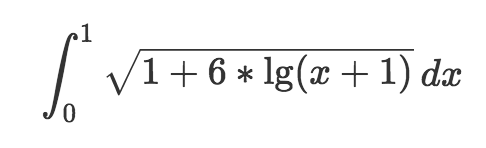
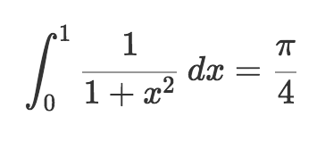
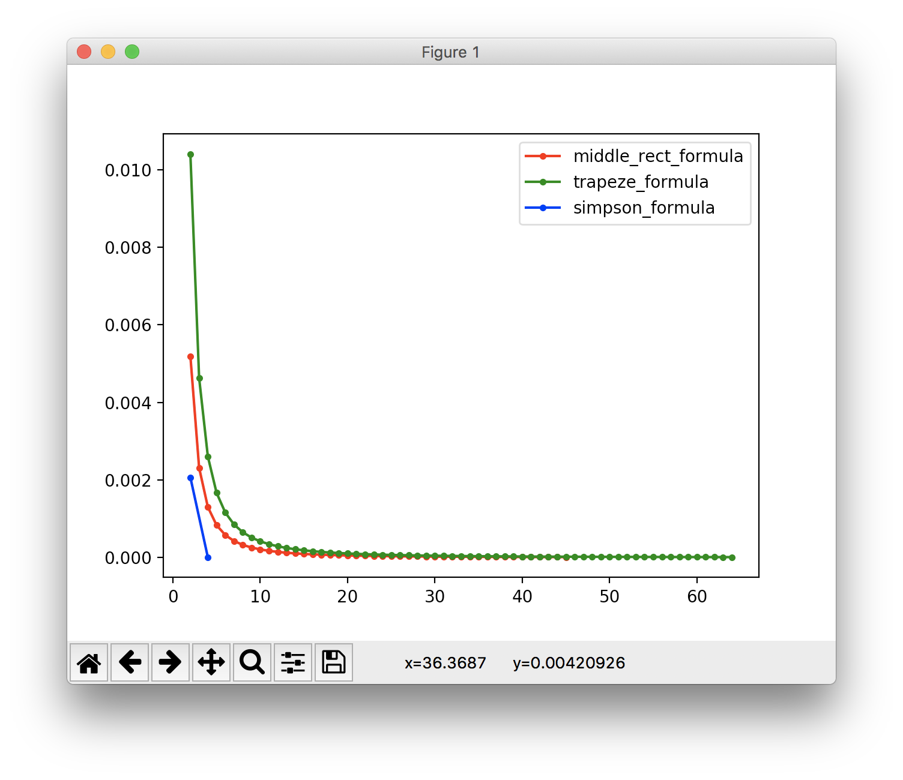
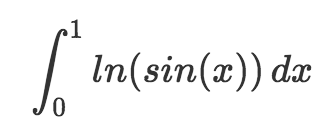

# Лабораторная №4
### Вихарев Вячеслав, КН-401, А=6
---

## Задание 1

<!-- $$\int_0^1 \sqrt{1+6*\lg(x+1)} \, dx$$ -->

а.

Метод                   | Значение при h = 0.1 | Значение при h = 0.05 | Погрешность по Рунге
----------------------- | -------------------- | --------------------- | --------------------
средних прямоугольников | 1.4043423842         | 1.4040583121          | 0.0000946907
трапеции                | 1.4032034405         | 1.4037729123          | 0.0001898240
Симпсона                | 1.4039561023         | 1.4039627363          | 0.0000004423

б.

**Квадратура Гаусса**: 1.4039632119

## Задание 2

<!-- $$\int_0^1 \frac1{1+x^2} \, dx= \frac\pi4$$ -->

Как видно, метод Симпсона достигает достаточно близкого к эталону значения (eps=0.000001) почти сразу 
Тогда как метод средних прямоугольников и метод трапеции подходят к эталону на eps=0.00001 лишь при разбиении отрезка приблизительно на 40 и 60 частей соответственно

## Задание 3

<!-- $$\int_0^1 ln(sin(x)) \, dx$$ -->

Примем за h значение 0.0001 
Тогда, воспользуясь методом средних прямоугольников, мы получим значение интеграла, равное -1.0566855489 
В то же время погрешность по Рунге будет оценена значением 0.0000057762
