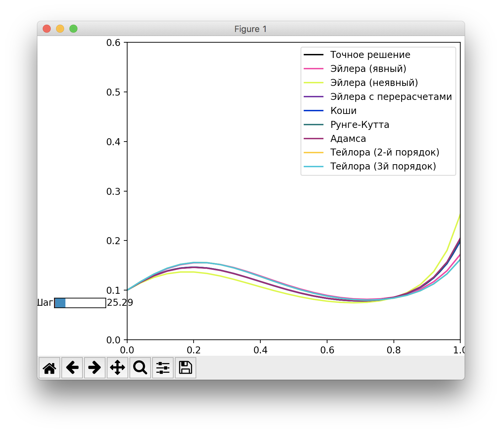

# Лабораторная №5
### Вихарев Вячеслав, КН-401, А=6
---

<!-- $$\begin{cases}y' = 30y(x-0.2)(x-0.7) &\text{x$\in [0, 1]$}\\y(0) = 0.1\end{cases}$$ -->
![\begin{cases}y' = 30y(x-0.2)(x-0.7) &\text{x$\in [0, 1]$}\\y(0) = 0.1\end{cases}](1.png)

#### Решив систему, получим

<!-- $$y=0.1\exp(x * (10x^2 - 13.5x + 4.2))$$ -->

#### Рассмотрим, как система решается методами
*Будем увеличивать разбиение, чтобы отследить изменения*

При разбиении, равном 5 шагам, все функции, полученные методами, находятся далеко от эталонного решения

Увеличиваем разбиение до 10 шагов. Уже заметно, насколько более "сгруппированными" стали функции. Кроме, пожалуй, полученного методом "Эйлер (неявный)"

При увеличении разбиения до 25 шагов едва ли можно разглядеть, какое количество функций сосредоточено вблизи эталонного решения

Шаг равен 70

При разбиении в 100 шагов даже функция, полученная методом "Эйлер (неявный)" довольно близко подошла к эталонной

Если приблизить график в точке 1.0, можно увидеть, что большое количество функций неразличимо с эталонной

#### Итог

Методы Рунге-Кутта, Коши, Эйлера с перерасчетами показали самую быструю сходимость 
Тогда как методы Эйлера (явный и неявный) и Тейлора (3й порядок) остались в стороне даже при разбиении отрезка на 100 шагов
