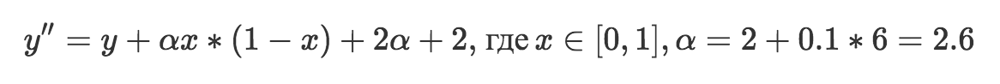
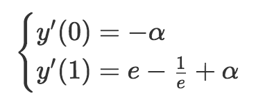
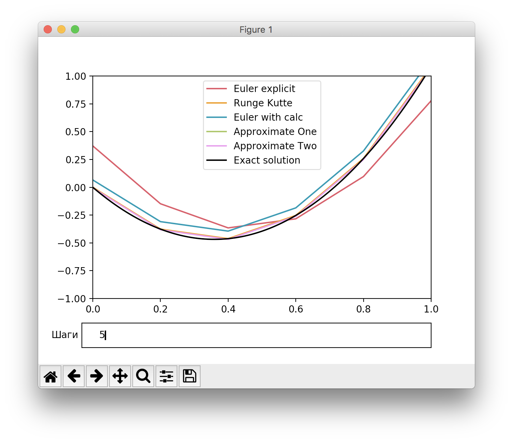
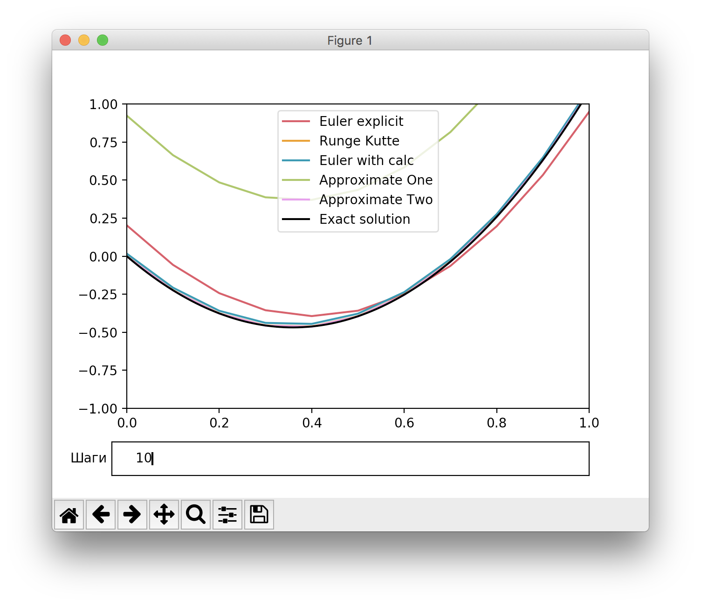
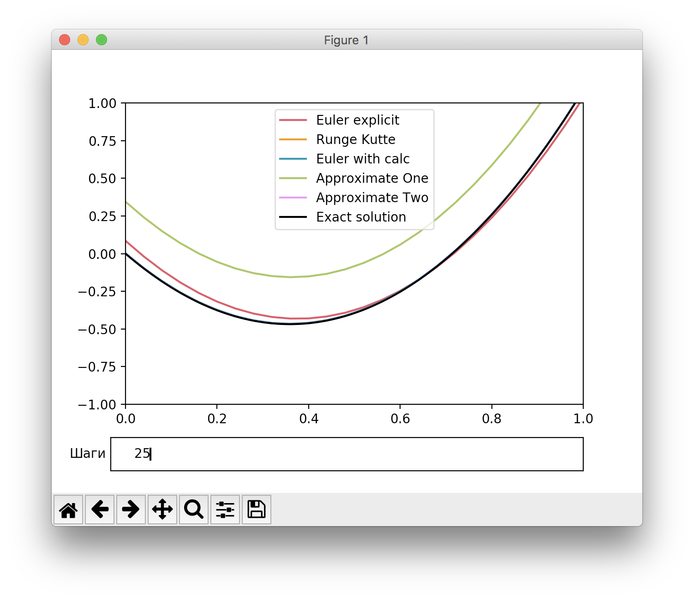
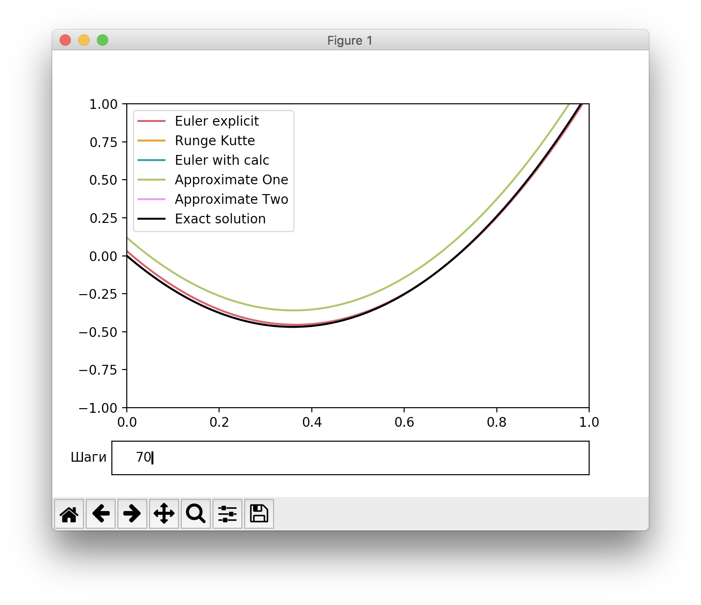
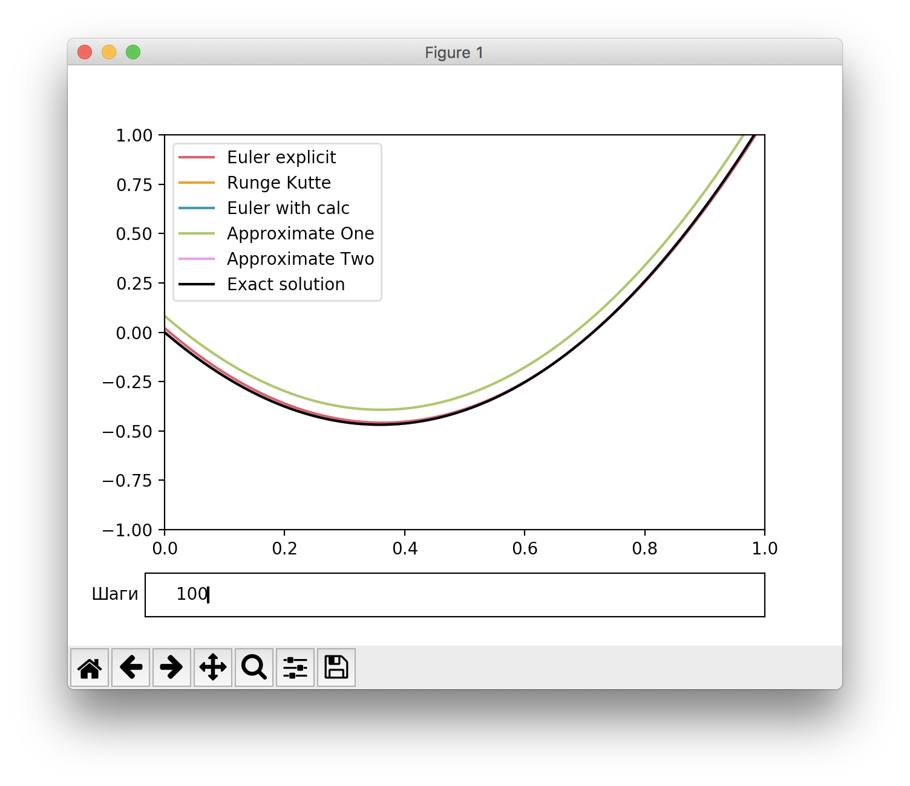

# Лабораторная №6
### Вихарев Вячеслав, КН-401, А=6
---

Краевая задача:

Начальные условия:

Снова пронаблюдаем поведение функций в зависимости от разбиения

Можно видеть, что хуже всего отрабатывает метод аппроксимации первого порядка - даже при разбиении интервала на 100 шагов он, в отличие от остальных, достаточно далёк от эталонного решения 
Среди методов стрельбы наихудшим оказался метод "Эйлер (явный)" 
Также стоит отметить, что даже при разбиении на 10 шагов почти все методы, кроме двух названных, довольно близки к эталону
